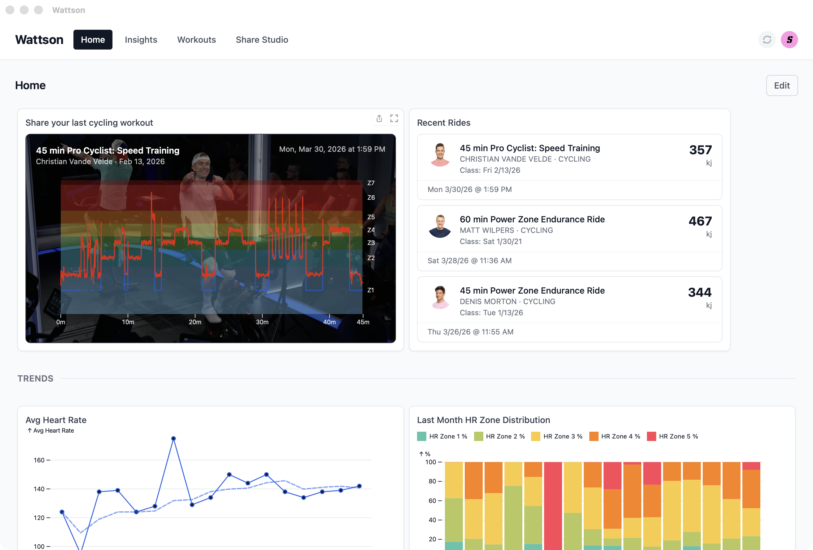
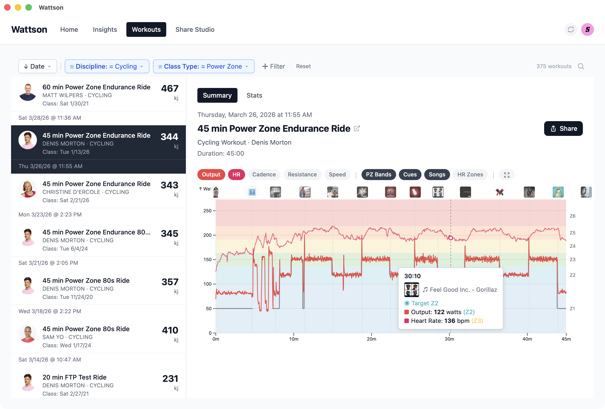
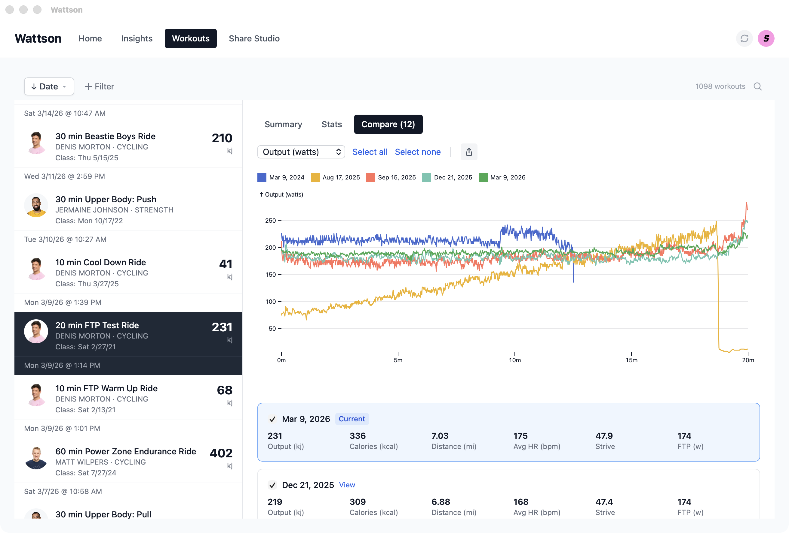
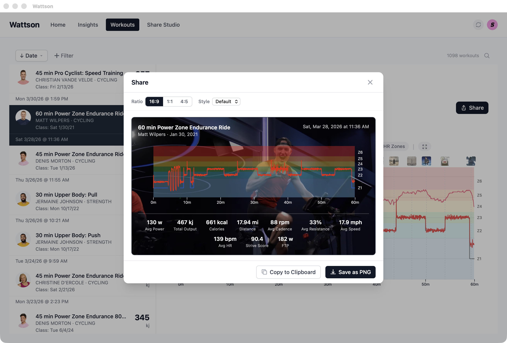
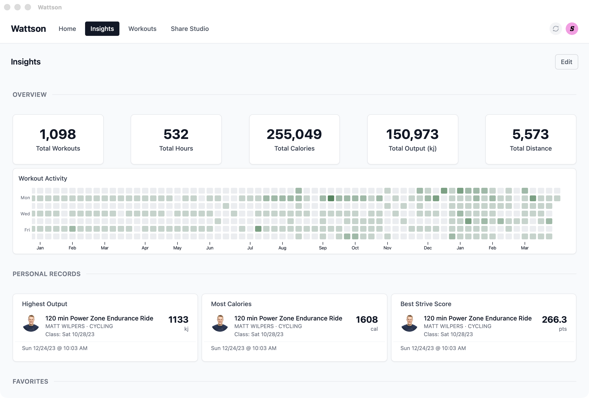
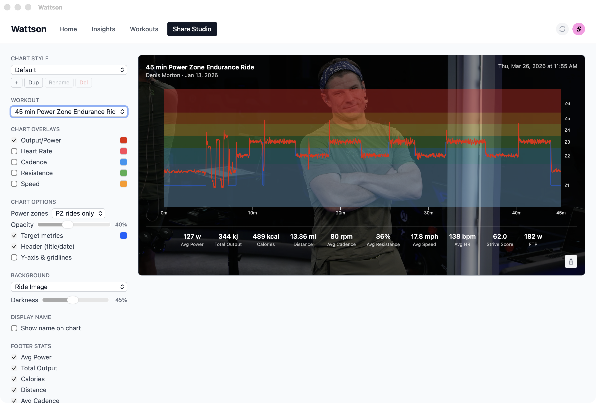

# Wattson

A free, open-source desktop app for analyzing your Peloton workout data. Sync your rides, build custom dashboards, compare repeated rides, and share charts — all locally on your machine with no server or cloud account required.

**Download:** [macOS (Apple Silicon)](https://github.com/skrul/wattson/releases/latest/download/Wattson_0.1.1_aarch64.dmg) | [macOS (Intel)](https://github.com/skrul/wattson/releases/latest/download/Wattson_0.1.1_x64.dmg) | [Windows](https://github.com/skrul/wattson/releases/latest/download/Wattson_0.1.1_x64-setup.exe) | [Linux (.deb)](https://github.com/skrul/wattson/releases/latest/download/Wattson_0.1.1_amd64.deb) | [Linux (.AppImage)](https://github.com/skrul/wattson/releases/latest/download/Wattson_0.1.1_amd64.AppImage)

## Features

- **Sync workouts** from your Peloton account with automatic background enrichment
- **Custom dashboards** — drag-and-drop widgets including charts, metrics, activity grids, personal records, workout lists, and more
- **Filter and sort** by date, duration, output, instructor, class type, and more
- **Custom charts** — build time-series and grouped charts with the built-in chart builder
- **Compare rides** — overlay multiple attempts of the same class to see progress over time
- **Per-ride detail** — interactive charts with toggleable overlays for power zones, HR zones, instructor cues, and song markers
- **Share** — export customized performance charts as PNG with a WYSIWYG preview, aspect ratio picker, and style themes
- **Auto-update** — the app checks for new versions on launch

All data stays on your machine in a local SQLite database. Credentials are stored in your system keychain (macOS Keychain, Windows Credential Manager).

## Screenshots

*Home dashboard with last workout, recent rides, and trend charts*


*Workout list with ride detail, interactive performance chart, and toggle overlays*


*Compare repeated rides with overlaid output curves*


*Share modal with WYSIWYG preview, aspect ratio picker, and style selector*


*Insights dashboard with lifetime stats, activity grid, and personal records*


*Studio chart editor with customizable overlays, power zones, and export*


## Install

Download the latest release for your platform from the [Releases](https://github.com/skrul/wattson/releases) page.

- **macOS**: `.dmg` (signed and notarized)
- **Windows**: `.msi` installer
- **Linux**: `.AppImage` or `.deb`

## Development

This is a [Tauri 2](https://v2.tauri.app/) app. See the [Tauri prerequisites](https://v2.tauri.app/start/prerequisites/) for platform-specific setup.

```bash
git clone https://github.com/skrul/wattson.git
cd wattson
pnpm install
pnpm tauri dev
```

## License

[MIT](LICENSE)
