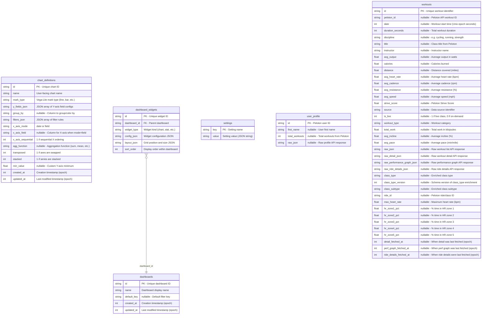

# Database Schema

> Auto-generated by `scripts/generate-schema-erd.sh`. Do not edit manually.

```mermaid
erDiagram
    %% chart_definitions: User-created chart configurations
    chart_definitions {
        string id "PK - Unique chart ID"
        string name "User-facing chart name"
        string mark_type "Vega-Lite mark type (line, bar, etc.)"
        string y_fields_json "JSON array of Y-axis field configs"
        string group_by "nullable - Column to group/color by"
        string filters_json "JSON array of filter rules"
        string x_axis_mode "date or field"
        string x_axis_field "nullable - Column for X-axis when mode=field"
        int x_axis_sequential "1 if sequential X ordering"
        string agg_function "nullable - Aggregation function (sum, mean, etc.)"
        int transposed "1 if axes are swapped"
        int stacked "1 if series are stacked"
        float min_value "nullable - Custom Y-axis minimum"
        int created_at "Creation timestamp (epoch)"
        int updated_at "Last modified timestamp (epoch)"
    }
    %% dashboard_widgets: Widgets placed on a dashboard
    dashboard_widgets {
        string id "PK - Unique widget ID"
        string dashboard_id "FK - Parent dashboard"
        string widget_type "Widget kind (chart, stat, etc.)"
        string config_json "Widget configuration JSON"
        string layout_json "Grid position and size JSON"
        int sort_order "Display order within dashboard"
    }
    %% dashboards: User-created dashboards
    dashboards {
        string id "PK - Unique dashboard ID"
        string name "Dashboard display name"
        string default_key "nullable - Default filter key"
        int created_at "Creation timestamp (epoch)"
        int updated_at "Last modified timestamp (epoch)"
    }
    %% settings: App key-value settings
    settings {
        string key "PK - Setting name"
        string value "Setting value (JSON string)"
    }
    %% user_profile: Cached Peloton user profile
    user_profile {
        string id "PK - Peloton user ID"
        string first_name "nullable - User first name"
        int total_workouts "nullable - Total workouts from Peloton"
        string raw_json "nullable - Raw profile API response"
    }
    %% workouts: Peloton workout sessions and computed metrics
    workouts {
        string id "PK - Unique workout identifier"
        string peloton_id "nullable - Peloton API workout ID"
        int date "nullable - Workout start time (Unix epoch seconds)"
        int duration_seconds "nullable - Total workout duration"
        string discipline "nullable - e.g. cycling, running, strength"
        string title "nullable - Class title from Peloton"
        string instructor "nullable - Instructor name"
        float avg_output "nullable - Average output in watts"
        float calories "nullable - Calories burned"
        float distance "nullable - Distance covered (miles)"
        float avg_heart_rate "nullable - Average heart rate (bpm)"
        float avg_cadence "nullable - Average cadence (rpm)"
        float avg_resistance "nullable - Average resistance (%)"
        float avg_speed "nullable - Average speed (mph)"
        float strive_score "nullable - Peloton Strive Score"
        string source "nullable - Data source identifier"
        int is_live "nullable - 1 if live class, 0 if on-demand"
        string workout_type "nullable - Workout category"
        float total_work "nullable - Total work in kilojoules"
        float avg_incline "nullable - Average incline (%)"
        float avg_pace "nullable - Average pace (min/mile)"
        string raw_json "nullable - Raw workout list API response"
        string raw_detail_json "nullable - Raw workout detail API response"
        string raw_performance_graph_json "nullable - Raw performance graph API response"
        string raw_ride_details_json "nullable - Raw ride details API response"
        string class_type "nullable - Enriched class type"
        int class_type_version "nullable - Schema version of class_type enrichment"
        string class_subtype "nullable - Enriched class subtype"
        string ride_id "nullable - Peloton ride/class ID"
        float max_heart_rate "nullable - Maximum heart rate (bpm)"
        float hr_zone1_pct "nullable - % time in HR zone 1"
        float hr_zone2_pct "nullable - % time in HR zone 2"
        float hr_zone3_pct "nullable - % time in HR zone 3"
        float hr_zone4_pct "nullable - % time in HR zone 4"
        float hr_zone5_pct "nullable - % time in HR zone 5"
        int detail_fetched_at "nullable - When detail was last fetched (epoch)"
        int perf_graph_fetched_at "nullable - When perf graph was last fetched (epoch)"
        int ride_details_fetched_at "nullable - When ride details were last fetched (epoch)"
    }
    dashboard_widgets }o--|| dashboards : "dashboard_id"
```
