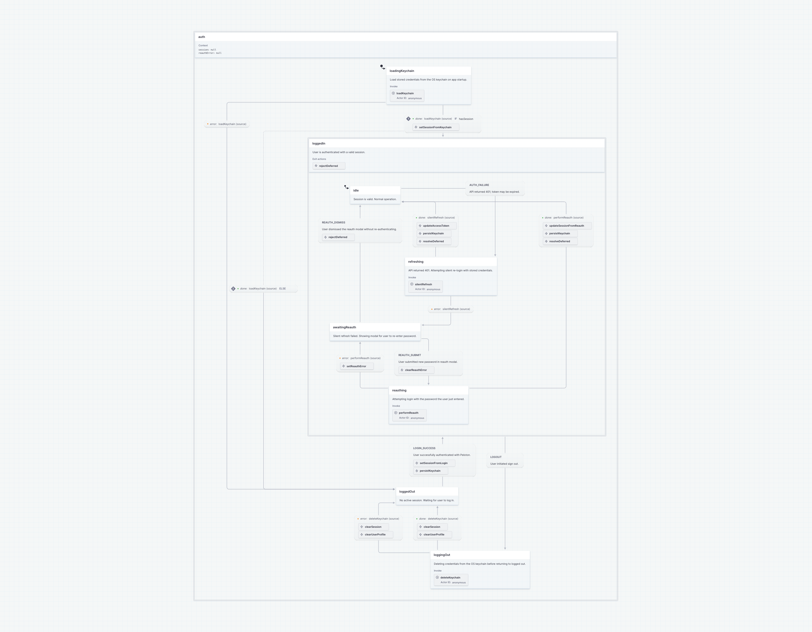
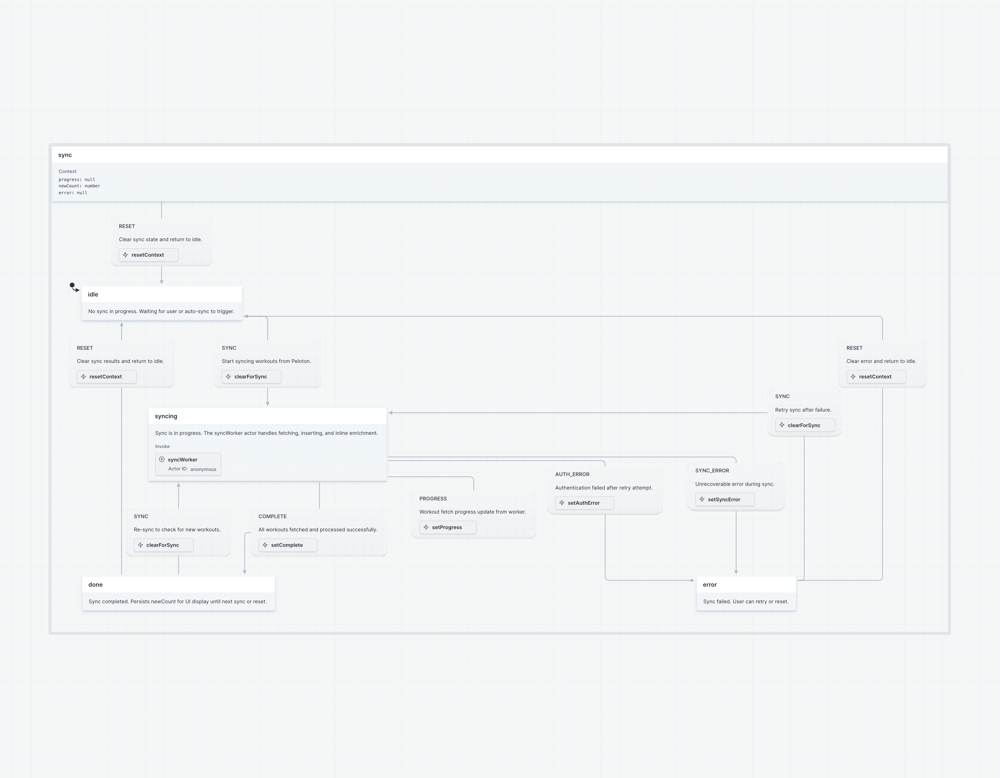
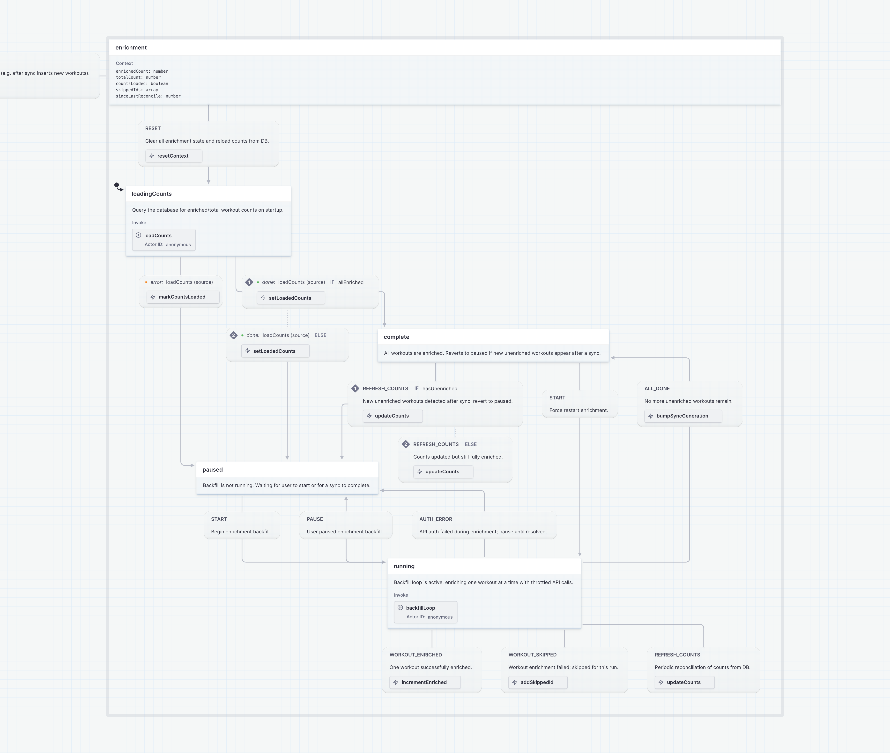

# State Machine Style Guide

This project uses [XState v5](https://stately.ai/docs) for state management. Each machine is split across two files and follows the conventions below.

## File Structure

Each machine lives in `src/machines/` as a pair:

| File | Purpose |
|------|---------|
| `fooMachine.config.ts` | Machine definition with stubs. Self-contained, no app imports. Can be pasted directly into the [Stately editor](https://stately.ai/editor) for visualization. |
| `fooMachine.ts` | Calls `.provide()` to supply real actor/action implementations, creates the global actor, and exports React hooks and selectors. |

### Why the split?

The config file must be importable by the Stately visualizer, which means it cannot pull in app dependencies (database, API, stores, Tauri). All external side effects live in the `.provide()` overrides in the companion file.

## Config File Conventions (`*.config.ts`)

### Header comment

Every config file starts with:

```ts
/**
 * Foo state machine definition.
 *
 * To visualize: copy this entire file into https://stately.ai/editor
 *
 * Note: `as any` casts are needed because guards/actions defined in setup()
 * don't have access to narrowed onDone/onError event types.
 */
```

### Types

Define event and context types above the machine. Export types that other files need (e.g. `SyncEvent` for the actor's type parameter).

```ts
export type FooEvent =
  | { type: "START" }
  | { type: "STOP" };

interface FooContext {
  count: number;
}
```

### Actors (stubs)

Actors in `setup()` are stubs that satisfy the type signature but do nothing:

```ts
actors: {
  loadData: fromPromise<Result>(async () => defaultValue),
  worker: fromCallback<EventType>(() => () => {}),
},
```

### Actions

- **Pure context updates** — implement directly with `assign()`. Note: the Stately editor cannot parse `assign()` on import, but this is acceptable since the state/transition structure is the primary visualization concern.
- **Side effects** (DB writes, store updates, Tauri IPC) — stub as `() => {}` and implement in the `.provide()` file.

```ts
actions: {
  // Pure context update — implemented here
  increment: assign({ count: ({ context }) => context.count + 1 }),

  // Side effect — stubbed, real implementation in .provide()
  persistToDb: () => {},
},
```

### Guards

Implement directly in `setup()`. Use `as any` casts for event access:

```ts
guards: {
  hasData: ({ event }: any) => event.output != null,
},
```

## Descriptions

Add `description` fields everywhere the Stately editor supports them. These show up in the visualization and serve as inline documentation.

### State descriptions (required)

Every state must have a description explaining its purpose:

```ts
paused: {
  description: "Backfill is not running. Waiting for user to start.",
  on: { ... },
},
```

### Transition descriptions (required)

Every event transition must have a description:

```ts
on: {
  START: {
    description: "User or auto-sync triggered a sync.",
    target: "running",
  },
},
```

This means never using the shorthand `EVENT: "targetState"` form — always use the object form so a description can be included.

### Invocation done/error descriptions (optional)

These can be added to `onDone`/`onError` transitions but are less critical since the invoked actor name usually makes the outcome clear.

## Companion File Conventions (`*.ts`)

### `.provide()` overrides

Supply real implementations for stubbed actors and actions:

```ts
const realFooMachine = fooMachine.provide({
  actors: {
    loadData: fromPromise(async () => {
      return await database.query(...);
    }),
  },
  actions: {
    persistToDb: ({ context }) => {
      database.save(context.data).catch(() => {});
    },
  },
});
```

### Global actor

Create and start a single global actor instance:

```ts
export const fooActor = createActor(realFooMachine).start();
```

### React hooks

Export a typed `useSelector` wrapper and named selectors:

```ts
type FooSnapshot = SnapshotFrom<typeof fooMachine>;

export function useFooSelector<T>(selector: (snap: FooSnapshot) => T): T {
  return useSelector(fooActor, selector);
}

export const selectIsRunning = (snap: FooSnapshot) => snap.matches("running");
```

## Callback Actors and Error Handling

For `fromCallback` actors that run async work internally:

- Wrap the async IIFE in `.catch()` and send error events via `sendBack()` — do not re-throw, since `fromCallback` does not propagate errors to the parent machine's `onError`.
- Use an `aborted` flag checked before every `sendBack()` call.
- Return a cleanup function that sets `aborted = true`.

```ts
fromCallback<FooEvent>(({ sendBack }) => {
  let aborted = false;

  (async () => {
    // ... async work ...
    if (!aborted) sendBack({ type: "COMPLETE" });
  })().catch((err) => {
    if (!aborted) {
      sendBack({ type: "ERROR", message: err.message });
    }
  });

  return () => { aborted = true; };
}),
```

## Existing Machines

| Machine | Config | Companion | Purpose |
|---------|--------|-----------|---------|
| Auth | `authMachine.config.ts` | `authMachine.ts` | Login, session management, token refresh, reauth |
| Enrichment | `enrichmentMachine.config.ts` | `enrichmentMachine.ts` | Background workout detail backfill |
| Sync | `syncMachine.config.ts` | `syncMachine.ts` | Workout sync from Peloton API |

## Diagrams

Diagrams are exported from the [Stately editor](https://stately.ai/editor) and stored as PNGs. To regenerate:

1. Copy the contents of the `.config.ts` file into the Stately editor
2. Export as PNG
3. Save to `docs/machines/` with the name shown below

Run `./scripts/check-machine-diagrams.sh` to see which diagrams are stale.

### Auth Machine



### Sync Machine



### Enrichment Machine


